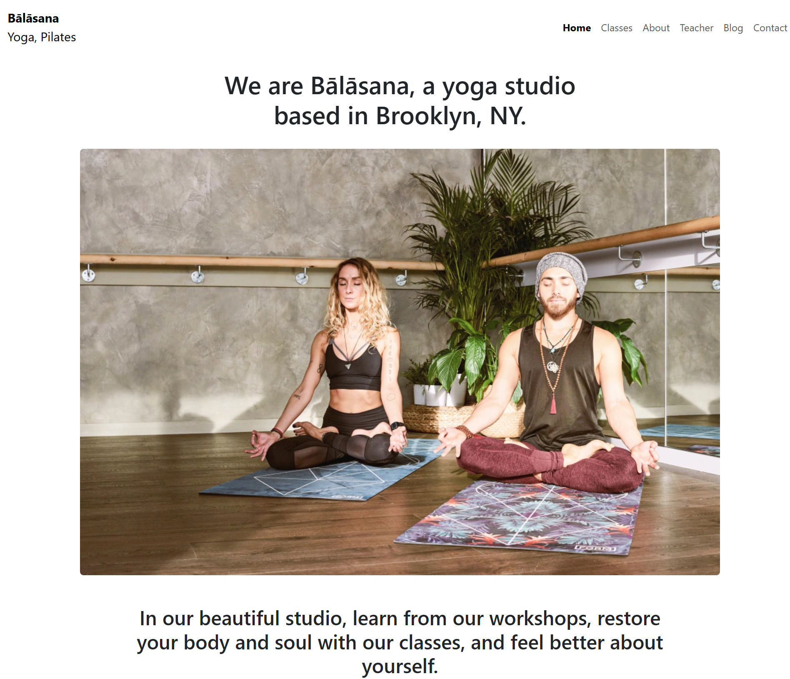

<h1 align="center">🎨 Front_Design - Bootstrap Template Clone</h1>

  A responsive frontend page built with <b>HTML, CSS, and Bootstrap</b>, inspired by WordPress template design!

---

## 🌐 Preview

  

---

## 📌 Overview

🚀 This project replicates a WordPress-style frontend layout using:

- 🧱 **HTML5** for structure  
- 🎨 **CSS3** for styling  
- 🌀 **Bootstrap** for responsiveness

The page is designed around a yoga/fitness concept (`Balasana.html`) with full layout and styling.

---

## 📁 Files Included

| File/Folder           | Description                          |
|-----------------------|--------------------------------------|
| `Balasana.html`       | Main HTML page (Yoga Template)       |
| `style.css`           | Custom styles for the page           |
| `.webp` images        | Template images (yoga, wellness, etc.) |
| `.gitattributes`      | Git formatting and language hints    |

---

## ✨ Features

- 💻 Responsive layout using **Bootstrap Grid**
- 📷 Clean visual design with **custom image content**
- 🎯 Good for beginners practicing frontend clones
- ⚡ Fast and minimal — no JS needed!

---

## 📚 Use Case

- 🧑‍🎓 Web design learners (BCA/B.Tech)
- 🧪 UI clone practice
- 💼 Portfolio projects

---

## 💡 Future Improvements

- Add **JavaScript** for dynamic features  
- Add more templates for different sections (Home, Services, Contact, etc.)  
- Responsive navbar or sticky menu

---

## 👨‍💻 Author

Made with ❤️ by [Rohan Mishra](https://github.com/Rohan3620)  
🎓 BCA 3rd Sem | Frontend Learner | Dreaming Big 🚀

---

⭐ If you like this design, consider giving a **star** and checking out my [portfolio](https://your-portfolio-link)!
